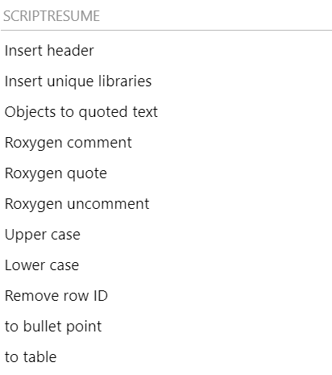
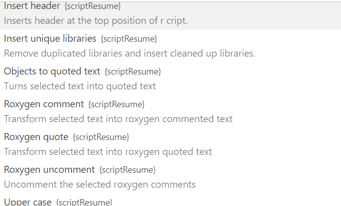

# scriptResume

I wrote this package to make peace with my own laziness. My routine
scripting work requires frequent documentation process. This R addin
package was born to facilitate coding experience. And of course, all the
default parameters are set to fit my own need. :zany_face: To achieve
the best user experience, I use these addin functions with keyboard
binding short cuts in VScode or other IDEs that allow user defined
keyboard shortcuts.

*I'm not sure how relevant this package can be outside of my current
workplace setting.* As I get lazier, I will add more addin functions and
of course, the existing functions will be tailed to my future needs.
:hear_no_evil:

# Installation

`scriptResume` summarized input/output lib usage from a R script. It can
be installed at command line: `R CMD INSTALL scriptResume_0.1.4.tgz` or
in R:

    install.packages(
        "scriptResume_0.1.4.tgz",
        repos = NULL, type = .Platform$pkgType
    )

or

    devtools::install_github("outboundbird/scriptResume")

# Features

## Addin features

-   `insert header` *auto detect and fill*:

    -   input/ output file and path
    -   libraries used in the script
    -   COMPUND/STUDY/ANALYSIS triplet code
    -   file generation date, file update date
    -   R version
    -   System info

an example of inserted header:

    # ******************************************************************************
    # Property of whom I sell my intellectual products to
    # Program name     : temp.R
    # Description      : why I spend hours on this file
    # Author           : my name
    # Compound number  : SAR123
    # Study code       : LPS123
    # Analysis code    : BMK-CSR
    # Date created     : 2023-01-27
    # Input files      : data/data.csv
    # Input programs   : this_file.R
    # Packages needed  : abc,
    #                    devtools,
    #                    dplyr,
    #                    stringr
    # Outputs created  :
    # R version        : R version 4.1.0 (2021-05-18)
    # Platform         : Windows-10 x64
    # ******************************************************************************
    # Modification status :
    # In progress | 2023-01-27 | my name
    # Description:
    # ******************************************************************************

-   insert unique libraries if you happen to read a messy script that
    libs are specified throughout the script. this function can help you
    to summarize the libs used in the currently open file.

-   object to quoted text a friend for copy-pasters.select a section of
    text that are separated by comma then transform them into a quoted
    vector.e.g, from `a, b, c` to `c("a", "b", "c")`

-   transform multiple text selection into Roxygen comments

-   uncomment Roxygen comments

-   transform to Roxygen comments with MD quote mark

-   transform selected text to upper or lower cases

## Package features

-   extract libraries used in a script
